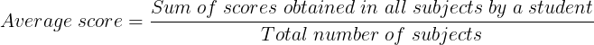

## Task

The National University conducts an examination of ***N*** students in ***X*** subjects.  
Your task is to compute the average scores of each student.  
<p align="center">
    
</p>

The format for the general mark sheet is:  
```
Student ID → ___1_____2_____3_____4_____5__               
Subject 1   |  89    90    78    93    80
Subject 2   |  90    91    85    88    86  
Subject 3   |  91    92    83    89    90.5
            |______________________________
Average        90    91    82    90    85.5 
```
**Input Format**

The first line contains ***N*** and ***X*** separated by a space.  
The next ***X*** lines contains the space separated marks obtained by students in a particular subject.  

**Output Format**

Print the averages of all students on separate lines.  
The averages must be correct up to **1** decimal place.  

**Sample Input**
```
5 3
89 90 78 93 80
90 91 85 88 86  
91 92 83 89 90.5
```
**Sample Output**
```
90.0 
91.0 
82.0 
90.0 
85.5
```    
**Explanation**

Marks obtained by **student 1: 89,90,91**  
Average marks of **student 1:**  
**270/3 =90**  

Marks obtained by **student 2: 90,91,92**  
Average marks of **student 2:**  
**273/3 =91**  

Marks obtained by **student 3: 78,85,83**  
Average marks of **student 3:**  
**246/3 =82**  

Marks obtained by **student 4: 93,88,89**  
Average marks of **student 4:**  
**270/3 =90**  

Marks obtained by **student 5: 80,86,90.5**  
Average marks of **student 5:**  
**256.5/3 =85.5**  
